# BÁO CÁO PHÂN TÍCH VÀ THIẾT KẾ HỆ THỐNG

# WEBSITE THƯƠNG MẠI ĐIỆN TỬ BÁN THIẾT BỊ ĐIỆN TỬ

---

## MỤC LỤC

1. [Giới thiệu tổng quan](#1-giới-thiệu-tổng-quan)
2. [Phân tích yêu cầu hệ thống](#2-phân-tích-yêu-cầu-hệ-thống)
3. [Biểu đồ Use Case](#3-biểu-đồ-use-case)
4. [Biểu đồ phân cấp chức năng](#4-biểu-đồ-phân-cấp-chức-năng)
5. [Sơ đồ luồng dữ liệu](#5-sơ-đồ-luồng-dữ-liệu)
    - 5.1 [Biểu đồ luồng dữ liệu mức ngữ cảnh](#51-biểu-đồ-luồng-dữ-liệu-mức-ngữ-cảnh)
    - 5.2 [Biểu đồ luồng dữ liệu mức đỉnh](#52-biểu-đồ-luồng-dữ-liệu-mức-đỉnh)
    - 5.3 [Sơ đồ mức dưới đỉnh](#53-sơ-đồ-mức-dưới-đỉnh)
6. [Sơ đồ lớp](#6-sơ-đồ-lớp)
7. [Mô hình thực thể liên kết (ERD)](#7-mô-hình-thực-thể-liên-kết-erd)
8. [Kết luận](#8-kết-luận)

---

## 1. Giới thiệu tổng quan

### 1.1. Mô tả hệ thống

Hệ thống Website Thương mại điện tử bán thiết bị điện tử (GEARVN Clone) là một nền tảng thương mại điện tử chuyên cung cấp các sản phẩm công nghệ và thiết bị điện tử bao gồm: máy tính để bàn (PC), laptop, màn hình, linh kiện máy tính (VGA, CPU, RAM, Mainboard, Ổ cứng, Nguồn, Tản nhiệt, Case), và các thiết bị ngoại vi (bàn phím, chuột).

Hệ thống được phát triển trên nền tảng Next.js - một framework React hiện đại, sử dụng MongoDB làm cơ sở dữ liệu và được triển khai theo kiến trúc Server-Side Rendering (SSR) kết hợp với Client-Side Rendering (CSR) để tối ưu hóa trải nghiệm người dùng.

### 1.2. Mục tiêu của hệ thống

-   Cung cấp giao diện trực quan, thân thiện để khách hàng có thể dễ dàng tìm kiếm và xem thông tin sản phẩm
-   Hỗ trợ phân loại sản phẩm theo danh mục để thuận tiện cho việc duyệt sản phẩm
-   Cung cấp chức năng tìm kiếm sản phẩm nhanh chóng và hiệu quả
-   Cho phép người dùng lưu các sản phẩm yêu thích vào danh sách wishlist
-   Hiển thị thông tin khuyến mãi và tin tức công nghệ cập nhật

### 1.3. Phạm vi hệ thống

Hệ thống hiện tại tập trung vào các chức năng hiển thị thông tin cho khách hàng (frontend), bao gồm:

-   Hiển thị trang chủ với các sản phẩm nổi bật
-   Quản lý danh mục sản phẩm
-   Xem chi tiết sản phẩm
-   Tìm kiếm sản phẩm
-   Quản lý danh sách yêu thích
-   Hiển thị tin tức và khuyến mãi

---

## 2. Phân tích yêu cầu hệ thống

### 2.1. Yêu cầu chức năng

| STT | Chức năng                  | Mô tả                                                                                    |
| --- | -------------------------- | ---------------------------------------------------------------------------------------- |
| 1   | Xem trang chủ              | Hiển thị banner quảng cáo, danh mục sản phẩm, sản phẩm bán chạy theo từng loại           |
| 2   | Xem danh mục sản phẩm      | Hiển thị danh sách tất cả danh mục sản phẩm có trong hệ thống                            |
| 3   | Xem sản phẩm theo danh mục | Lọc và hiển thị sản phẩm theo danh mục được chọn                                         |
| 4   | Xem chi tiết sản phẩm      | Hiển thị thông tin chi tiết của sản phẩm bao gồm hình ảnh, giá, thông số kỹ thuật, mô tả |
| 5   | Tìm kiếm sản phẩm          | Tìm kiếm sản phẩm theo tên hoặc từ khóa                                                  |
| 6   | Quản lý sản phẩm yêu thích | Thêm/xóa sản phẩm vào danh sách yêu thích, xem danh sách yêu thích                       |
| 7   | Xem tin tức                | Hiển thị danh sách tin tức và chi tiết bài viết                                          |
| 8   | Xem khuyến mãi             | Hiển thị danh sách chương trình khuyến mãi và chi tiết khuyến mãi                        |

### 2.2. Yêu cầu phi chức năng

| STT | Yêu cầu          | Mô tả                                                           |
| --- | ---------------- | --------------------------------------------------------------- |
| 1   | Hiệu năng        | Trang web phải tải nhanh, thời gian phản hồi dưới 3 giây        |
| 2   | Khả năng mở rộng | Hệ thống có thể mở rộng để thêm nhiều sản phẩm và chức năng mới |
| 3   | Tương thích      | Hỗ trợ các trình duyệt phổ biến và thiết bị di động             |
| 4   | Bảo mật          | Bảo vệ thông tin người dùng và dữ liệu hệ thống                 |
| 5   | Khả dụng         | Hệ thống hoạt động 24/7 với độ khả dụng cao                     |

### 2.3. Danh sách các thực thể chính

| STT | Thực thể               | Mô tả                                     |
| --- | ---------------------- | ----------------------------------------- |
| 1   | Product (Sản phẩm)     | Lưu trữ thông tin về các sản phẩm điện tử |
| 2   | Category (Danh mục)    | Phân loại các sản phẩm theo nhóm          |
| 3   | News (Tin tức)         | Lưu trữ các bài viết tin tức công nghệ    |
| 4   | Promotion (Khuyến mãi) | Thông tin về các chương trình khuyến mãi  |

---

## 3. Biểu đồ Use Case

### 3.1. Mô tả tác nhân

| Tác nhân              | Mô tả                                                   |
| --------------------- | ------------------------------------------------------- |
| Khách hàng (Customer) | Người dùng truy cập website để xem và tìm kiếm sản phẩm |
| Hệ thống (System)     | Xử lý các yêu cầu và trả về dữ liệu tương ứng           |

### 3.2. Biểu đồ Use Case tổng quát

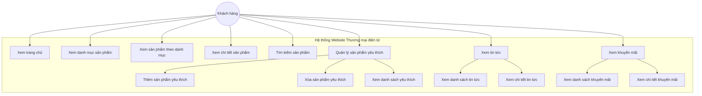

### 3.3. Mô tả chi tiết các Use Case

#### UC1: Xem trang chủ

| Thuộc tính           | Mô tả                                                                                                                                                                                                                              |
| -------------------- | ---------------------------------------------------------------------------------------------------------------------------------------------------------------------------------------------------------------------------------- |
| Tên Use Case         | Xem trang chủ                                                                                                                                                                                                                      |
| Tác nhân             | Khách hàng                                                                                                                                                                                                                         |
| Mô tả                | Người dùng truy cập trang chủ để xem các thông tin tổng quan                                                                                                                                                                       |
| Điều kiện tiên quyết | Không có                                                                                                                                                                                                                           |
| Luồng chính          | 1. Người dùng truy cập trang chủ 2. Hệ thống hiển thị banner quảng cáo 3. Hệ thống hiển thị danh mục sản phẩm 4. Hệ thống hiển thị các sản phẩm bán chạy theo từng danh mục 5. Hệ thống hiển thị tin tức và khuyến mãi |
| Kết quả              | Trang chủ được hiển thị đầy đủ thông tin                                                                                                                                                                                           |

#### UC2: Xem danh mục sản phẩm

| Thuộc tính           | Mô tả                                                                                                                                                         |
| -------------------- | ------------------------------------------------------------------------------------------------------------------------------------------------------------- |
| Tên Use Case         | Xem danh mục sản phẩm                                                                                                                                         |
| Tác nhân             | Khách hàng                                                                                                                                                    |
| Mô tả                | Người dùng xem tất cả các danh mục sản phẩm có trong hệ thống                                                                                                 |
| Điều kiện tiên quyết | Không có                                                                                                                                                      |
| Luồng chính          | 1. Người dùng xem phần danh mục trên trang chủ 2. Hệ thống lấy danh sách danh mục từ cơ sở dữ liệu 3. Hệ thống hiển thị danh sách danh mục kèm hình ảnh |
| Kết quả              | Danh sách danh mục được hiển thị                                                                                                                              |

#### UC3: Xem sản phẩm theo danh mục

| Thuộc tính           | Mô tả                                                                                                                                             |
| -------------------- | ------------------------------------------------------------------------------------------------------------------------------------------------- |
| Tên Use Case         | Xem sản phẩm theo danh mục                                                                                                                        |
| Tác nhân             | Khách hàng                                                                                                                                        |
| Mô tả                | Người dùng xem các sản phẩm thuộc một danh mục cụ thể                                                                                             |
| Điều kiện tiên quyết | Danh mục tồn tại trong hệ thống                                                                                                                   |
| Luồng chính          | 1. Người dùng chọn một danh mục 2. Hệ thống lấy danh sách sản phẩm thuộc danh mục đó 3. Hệ thống hiển thị danh sách sản phẩm với các bộ lọc |
| Luồng thay thế       | Nếu không tìm thấy danh mục, hiển thị thông báo lỗi                                                                                               |
| Kết quả              | Danh sách sản phẩm theo danh mục được hiển thị                                                                                                    |

#### UC4: Xem chi tiết sản phẩm

| Thuộc tính           | Mô tả                                                                                                                                                                            |
| -------------------- | -------------------------------------------------------------------------------------------------------------------------------------------------------------------------------- |
| Tên Use Case         | Xem chi tiết sản phẩm                                                                                                                                                            |
| Tác nhân             | Khách hàng                                                                                                                                                                       |
| Mô tả                | Người dùng xem thông tin chi tiết của một sản phẩm                                                                                                                               |
| Điều kiện tiên quyết | Sản phẩm tồn tại trong hệ thống                                                                                                                                                  |
| Luồng chính          | 1. Người dùng chọn một sản phẩm 2. Hệ thống lấy thông tin chi tiết sản phẩm 3. Hệ thống hiển thị hình ảnh, giá, thông số, mô tả 4. Hệ thống hiển thị sản phẩm liên quan |
| Luồng thay thế       | Nếu không tìm thấy sản phẩm, hiển thị trang 404                                                                                                                                  |
| Kết quả              | Chi tiết sản phẩm được hiển thị                                                                                                                                                  |

#### UC5: Tìm kiếm sản phẩm

| Thuộc tính           | Mô tả                                                                                                                                                        |
| -------------------- | ------------------------------------------------------------------------------------------------------------------------------------------------------------ |
| Tên Use Case         | Tìm kiếm sản phẩm                                                                                                                                            |
| Tác nhân             | Khách hàng                                                                                                                                                   |
| Mô tả                | Người dùng tìm kiếm sản phẩm theo từ khóa                                                                                                                    |
| Điều kiện tiên quyết | Không có                                                                                                                                                     |
| Luồng chính          | 1. Người dùng nhập từ khóa tìm kiếm 2. Người dùng nhấn nút tìm kiếm 3. Hệ thống tìm sản phẩm khớp với từ khóa 4. Hệ thống hiển thị kết quả tìm kiếm |
| Luồng thay thế       | Nếu không tìm thấy sản phẩm, hiển thị thông báo không có kết quả                                                                                             |
| Kết quả              | Danh sách sản phẩm khớp với từ khóa được hiển thị                                                                                                            |

#### UC6: Quản lý sản phẩm yêu thích

| Thuộc tính           | Mô tả                                                                                                                                                                  |
| -------------------- | ---------------------------------------------------------------------------------------------------------------------------------------------------------------------- |
| Tên Use Case         | Quản lý sản phẩm yêu thích                                                                                                                                             |
| Tác nhân             | Khách hàng                                                                                                                                                             |
| Mô tả                | Người dùng quản lý danh sách sản phẩm yêu thích                                                                                                                        |
| Điều kiện tiên quyết | Không có                                                                                                                                                               |
| Luồng chính          | 1. Người dùng có thể thêm sản phẩm vào danh sách yêu thích 2. Người dùng có thể xóa sản phẩm khỏi danh sách 3. Người dùng có thể xem toàn bộ danh sách yêu thích |
| Kết quả              | Danh sách yêu thích được cập nhật/hiển thị                                                                                                                             |

---

## 4. Biểu đồ phân cấp chức năng

Biểu đồ phân cấp chức năng (Function Hierarchy Diagram - FHD) thể hiện cấu trúc phân cấp của các chức năng trong hệ thống, từ chức năng tổng quát đến các chức năng chi tiết.

```mermaid
flowchart TB
    F0["HỆ THỐNG WEBSITE<br/>THƯƠNG MẠI ĐIỆN TỬ"]

    F1["1. QUẢN LÝ<br/>SẢN PHẨM"]
    F2["2. QUẢN LÝ<br/>DANH MỤC"]
    F3["3. QUẢN LÝ<br/>TIN TỨC"]
    F4["4. QUẢN LÝ<br/>KHUYẾN MÃI"]
    F5["5. QUẢN LÝ<br/>YÊU THÍCH"]

    F1_1["1.1 Hiển thị<br/>danh sách sản phẩm"]
    F1_2["1.2 Xem chi tiết<br/>sản phẩm"]
    F1_3["1.3 Tìm kiếm<br/>sản phẩm"]
    F1_4["1.4 Lọc sản phẩm<br/>theo tiêu chí"]

    F2_1["2.1 Hiển thị<br/>danh sách danh mục"]
    F2_2["2.2 Xem sản phẩm<br/>theo danh mục"]

    F3_1["3.1 Hiển thị<br/>danh sách tin tức"]
    F3_2["3.2 Xem chi tiết<br/>tin tức"]

    F4_1["4.1 Hiển thị<br/>danh sách khuyến mãi"]
    F4_2["4.2 Xem chi tiết<br/>khuyến mãi"]

    F5_1["5.1 Thêm sản phẩm<br/>yêu thích"]
    F5_2["5.2 Xóa sản phẩm<br/>yêu thích"]
    F5_3["5.3 Xem danh sách<br/>yêu thích"]
    F5_4["5.4 Xóa tất cả<br/>yêu thích"]

    F0 --> F1
    F0 --> F2
    F0 --> F3
    F0 --> F4
    F0 --> F5

    F1 --> F1_1
    F1 --> F1_2
    F1 --> F1_3
    F1 --> F1_4

    F2 --> F2_1
    F2 --> F2_2

    F3 --> F3_1
    F3 --> F3_2

    F4 --> F4_1
    F4 --> F4_2

    F5 --> F5_1
    F5 --> F5_2
    F5 --> F5_3
    F5 --> F5_4
```

### Bảng mô tả chức năng

| Mã chức năng | Tên chức năng                 | Mô tả                                                     |
| ------------ | ----------------------------- | --------------------------------------------------------- |
| 1            | Quản lý sản phẩm              | Các chức năng liên quan đến hiển thị và tìm kiếm sản phẩm |
| 1.1          | Hiển thị danh sách sản phẩm   | Hiển thị danh sách sản phẩm theo các tiêu chí khác nhau   |
| 1.2          | Xem chi tiết sản phẩm         | Hiển thị thông tin chi tiết của một sản phẩm              |
| 1.3          | Tìm kiếm sản phẩm             | Tìm kiếm sản phẩm theo tên hoặc từ khóa                   |
| 1.4          | Lọc sản phẩm theo tiêu chí    | Lọc sản phẩm theo thương hiệu, giá, thông số              |
| 2            | Quản lý danh mục              | Các chức năng liên quan đến danh mục sản phẩm             |
| 2.1          | Hiển thị danh sách danh mục   | Hiển thị tất cả danh mục có trong hệ thống                |
| 2.2          | Xem sản phẩm theo danh mục    | Hiển thị sản phẩm thuộc một danh mục cụ thể               |
| 3            | Quản lý tin tức               | Các chức năng liên quan đến tin tức                       |
| 3.1          | Hiển thị danh sách tin tức    | Hiển thị danh sách các bài viết tin tức                   |
| 3.2          | Xem chi tiết tin tức          | Hiển thị nội dung chi tiết bài viết                       |
| 4            | Quản lý khuyến mãi            | Các chức năng liên quan đến khuyến mãi                    |
| 4.1          | Hiển thị danh sách khuyến mãi | Hiển thị các chương trình khuyến mãi                      |
| 4.2          | Xem chi tiết khuyến mãi       | Hiển thị chi tiết chương trình khuyến mãi                 |
| 5            | Quản lý yêu thích             | Các chức năng liên quan đến danh sách yêu thích           |
| 5.1          | Thêm sản phẩm yêu thích       | Thêm sản phẩm vào danh sách yêu thích                     |
| 5.2          | Xóa sản phẩm yêu thích        | Xóa sản phẩm khỏi danh sách yêu thích                     |
| 5.3          | Xem danh sách yêu thích       | Hiển thị tất cả sản phẩm trong danh sách yêu thích        |
| 5.4          | Xóa tất cả yêu thích          | Xóa toàn bộ sản phẩm trong danh sách yêu thích            |

---

## 5. Sơ đồ luồng dữ liệu

### 5.1. Biểu đồ luồng dữ liệu mức ngữ cảnh

Biểu đồ luồng dữ liệu mức ngữ cảnh (Context Diagram - Level 0) thể hiện cái nhìn tổng quan về hệ thống và các tác nhân bên ngoài tương tác với hệ thống.

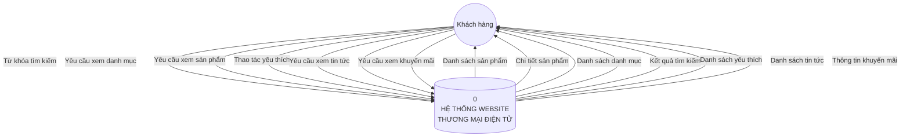

### 5.2. Biểu đồ luồng dữ liệu mức đỉnh

Biểu đồ luồng dữ liệu mức đỉnh (Level 1 DFD) chi tiết hóa các tiến trình chính trong hệ thống.

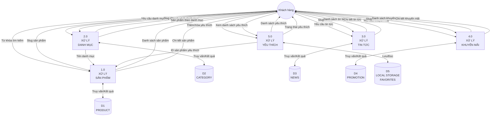

### 5.3. Sơ đồ mức dưới đỉnh

#### 5.3.1. Sơ đồ mức dưới đỉnh 1: Xử lý sản phẩm

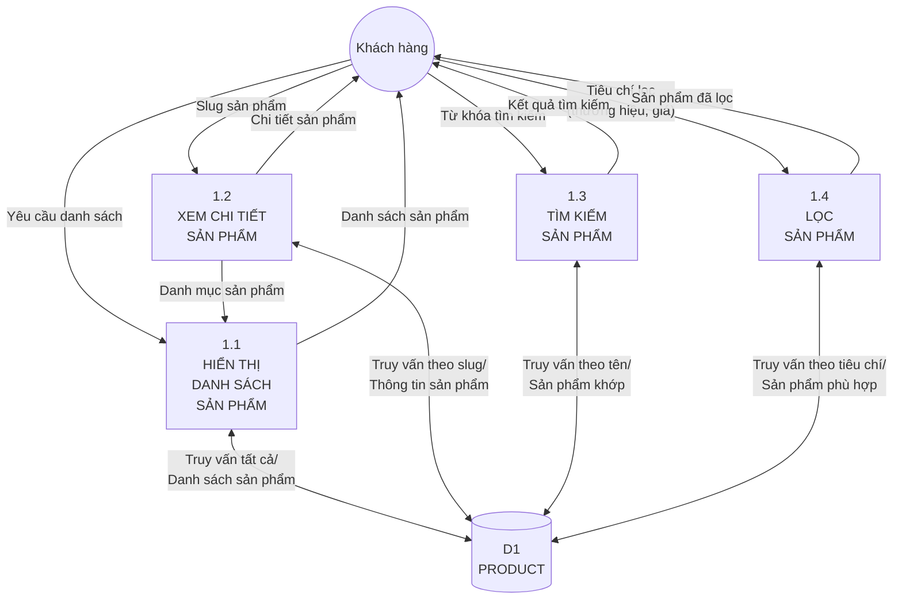

#### 5.3.2. Sơ đồ mức dưới đỉnh 2: Xử lý danh mục

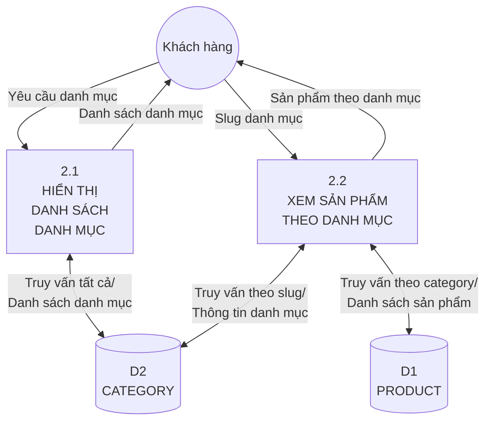

#### 5.3.3. Sơ đồ mức dưới đỉnh 3: Xử lý tin tức

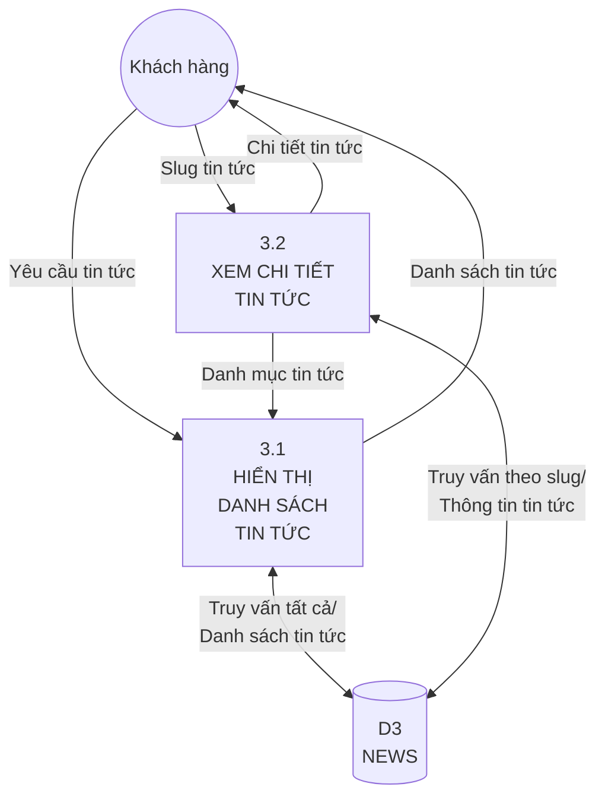

#### 5.3.4. Sơ đồ mức dưới đỉnh 4: Xử lý khuyến mãi

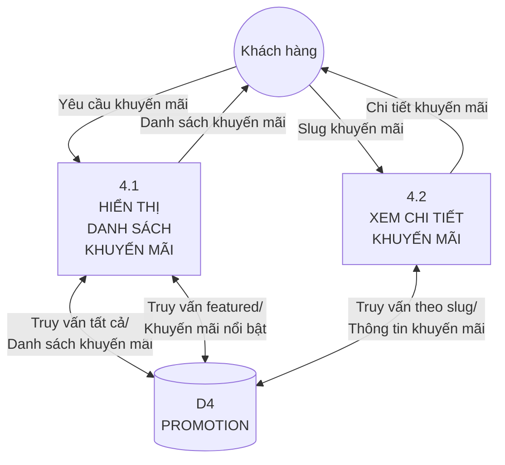

#### 5.3.5. Sơ đồ mức dưới đỉnh 5: Xử lý yêu thích

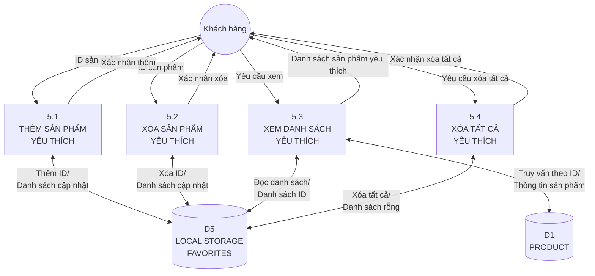

---

## 6. Sơ đồ lớp

Sơ đồ lớp (Class Diagram) thể hiện cấu trúc các lớp đối tượng trong hệ thống và mối quan hệ giữa chúng.

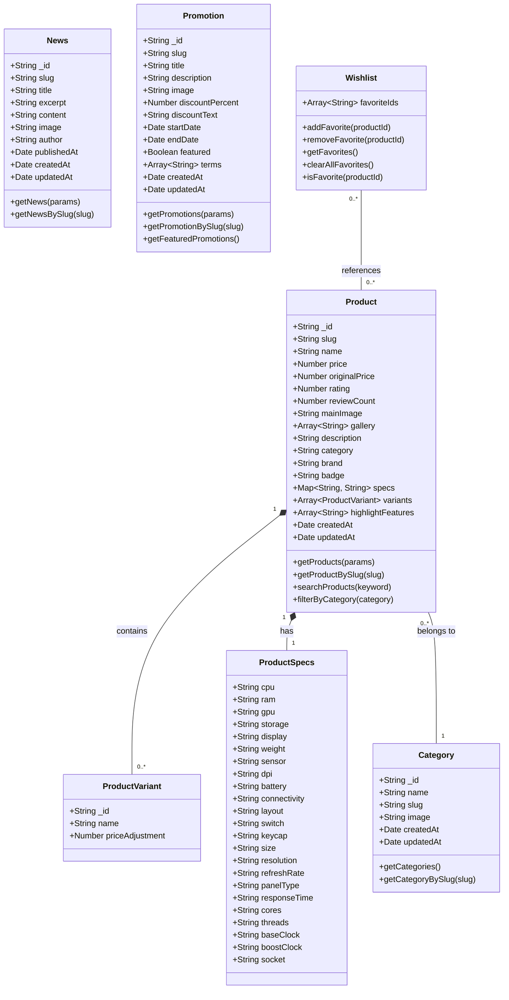

### Mô tả các lớp

| Lớp            | Mô tả                                                                         |
| -------------- | ----------------------------------------------------------------------------- |
| Product        | Lớp đại diện cho sản phẩm trong hệ thống, chứa thông tin chi tiết về sản phẩm |
| ProductVariant | Lớp đại diện cho các biến thể của sản phẩm (ví dụ: RAM 32GB, SSD 2TB)         |
| ProductSpecs   | Lớp chứa thông số kỹ thuật của sản phẩm                                       |
| Category       | Lớp đại diện cho danh mục sản phẩm                                            |
| News           | Lớp đại diện cho bài viết tin tức                                             |
| Promotion      | Lớp đại diện cho chương trình khuyến mãi                                      |
| Wishlist       | Lớp quản lý danh sách sản phẩm yêu thích của người dùng                       |

---

## 7. Mô hình thực thể liên kết (ERD)

### 7.1. Mô hình thực thể liên kết

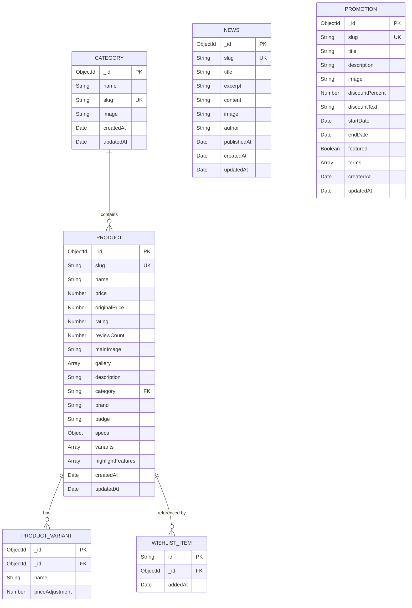

### 7.2. Mô tả chi tiết các thực thể

#### Bảng CATEGORY (Danh mục)

| Tên thuộc tính | Kiểu dữ liệu | Ràng buộc        | Mô tả                              |
| -------------- | ------------ | ---------------- | ---------------------------------- |
| \_id           | ObjectId     | Primary Key      | Mã định danh duy nhất của danh mục |
| name           | String       | Not Null         | Tên danh mục                       |
| slug           | String       | Unique, Not Null | Đường dẫn thân thiện URL           |
| image          | String       |                  | Đường dẫn hình ảnh danh mục        |
| createdAt      | Date         | Auto             | Thời điểm tạo                      |
| updatedAt      | Date         | Auto             | Thời điểm cập nhật                 |

#### Bảng PRODUCT (Sản phẩm)

| Tên thuộc tính    | Kiểu dữ liệu  | Ràng buộc                    | Mô tả                                      |
| ----------------- | ------------- | ---------------------------- | ------------------------------------------ |
| \_id              | ObjectId      | Primary Key                  | Mã định danh duy nhất của sản phẩm         |
| slug              | String        | Unique, Not Null             | Đường dẫn thân thiện URL                   |
| name              | String        | Not Null                     | Tên sản phẩm                               |
| price             | Number        | Not Null                     | Giá bán hiện tại                           |
| originalPrice     | Number        | Not Null                     | Giá gốc                                    |
| rating            | Number        | Default: 0                   | Điểm đánh giá trung bình                   |
| reviewCount       | Number        | Default: 0                   | Số lượng đánh giá                          |
| mainImage         | String        |                              | Hình ảnh chính                             |
| gallery           | Array[String] |                              | Danh sách hình ảnh phụ                     |
| description       | String        |                              | Mô tả sản phẩm                             |
| category          | String        | Foreign Key, Not Null, Index | Tên danh mục (tham chiếu CATEGORY.name)    |
| brand             | String        | Index                        | Thương hiệu                                |
| badge             | String        |                              | Nhãn hiển thị (Quà tặng HOT, Giá tốt, ...) |
| specs             | Object        |                              | Thông số kỹ thuật                          |
| variants          | Array[Object] |                              | Danh sách biến thể                         |
| highlightFeatures | Array[String] |                              | Tính năng nổi bật                          |
| createdAt         | Date          | Auto                         | Thời điểm tạo                              |
| updatedAt         | Date          | Auto                         | Thời điểm cập nhật                         |

#### Bảng PRODUCT_VARIANT (Biến thể sản phẩm)

| Tên thuộc tính  | Kiểu dữ liệu | Ràng buộc   | Mô tả                         |
| --------------- | ------------ | ----------- | ----------------------------- |
| \_id            | ObjectId     | Primary Key | Mã định danh duy nhất         |
| \_id (Product)  | ObjectId     | Foreign Key | Tham chiếu đến PRODUCT.\_id   |
| name            | String       |             | Tên biến thể                  |
| priceAdjustment | Number       |             | Điều chỉnh giá so với giá gốc |

#### Bảng NEWS (Tin tức)

| Tên thuộc tính | Kiểu dữ liệu | Ràng buộc        | Mô tả                    |
| -------------- | ------------ | ---------------- | ------------------------ |
| \_id           | ObjectId     | Primary Key      | Mã định danh duy nhất    |
| slug           | String       | Unique, Not Null | Đường dẫn thân thiện URL |
| title          | String       | Not Null         | Tiêu đề bài viết         |
| excerpt        | String       | Not Null         | Tóm tắt nội dung         |
| content        | String       | Not Null         | Nội dung chi tiết        |
| image          | String       |                  | Hình ảnh đại diện        |
| author         | String       |                  | Tác giả                  |
| publishedAt    | Date         |                  | Thời điểm đăng bài       |
| createdAt      | Date         | Auto             | Thời điểm tạo            |
| updatedAt      | Date         | Auto             | Thời điểm cập nhật       |

#### Bảng PROMOTION (Khuyến mãi)

| Tên thuộc tính  | Kiểu dữ liệu  | Ràng buộc        | Mô tả                    |
| --------------- | ------------- | ---------------- | ------------------------ |
| \_id            | ObjectId      | Primary Key      | Mã định danh duy nhất    |
| slug            | String        | Unique, Not Null | Đường dẫn thân thiện URL |
| title           | String        | Not Null         | Tiêu đề khuyến mãi       |
| description     | String        | Not Null         | Mô tả khuyến mãi         |
| image           | String        |                  | Hình ảnh banner          |
| discountPercent | Number        |                  | Phần trăm giảm giá       |
| discountText    | String        |                  | Mô tả giảm giá           |
| startDate       | Date          |                  | Ngày bắt đầu             |
| endDate         | Date          |                  | Ngày kết thúc            |
| featured        | Boolean       | Default: false   | Khuyến mãi nổi bật       |
| terms           | Array[String] |                  | Điều kiện và điều khoản  |
| createdAt       | Date          | Auto             | Thời điểm tạo            |
| updatedAt       | Date          | Auto             | Thời điểm cập nhật       |

#### Bảng WISHLIST_ITEM (Sản phẩm yêu thích)

| Tên thuộc tính | Kiểu dữ liệu | Ràng buộc   | Mô tả                        |
| -------------- | ------------ | ----------- | ---------------------------- |
| id             | String       | Primary Key | Mã định danh duy nhất        |
| \_id (Product) | ObjectId     | Foreign Key | Tham chiếu đến PRODUCT.\_id  |
| addedAt        | Date         |             | Thời điểm thêm vào yêu thích |

### 7.3. Mô tả các mối quan hệ

| Mối quan hệ               | Mô tả                                                                       | Loại |
| ------------------------- | --------------------------------------------------------------------------- | ---- |
| CATEGORY - PRODUCT        | Một danh mục có thể chứa nhiều sản phẩm, một sản phẩm thuộc về một danh mục | 1:N  |
| PRODUCT - PRODUCT_VARIANT | Một sản phẩm có thể có nhiều biến thể                                       | 1:N  |
| PRODUCT - WISHLIST_ITEM   | Một sản phẩm có thể được thêm vào nhiều danh sách yêu thích                 | 1:N  |

---

## 8. Kết luận

### 8.1. Tổng kết

Báo cáo đã trình bày đầy đủ các khía cạnh phân tích và thiết kế của hệ thống Website Thương mại điện tử bán thiết bị điện tử, bao gồm:

1. **Biểu đồ Use Case**: Xác định các chức năng chính của hệ thống và tương tác với người dùng
2. **Biểu đồ phân cấp chức năng**: Phân rã các chức năng từ tổng quát đến chi tiết
3. **Sơ đồ luồng dữ liệu**: Mô tả luồng thông tin trong hệ thống ở các mức độ chi tiết khác nhau
4. **Sơ đồ lớp**: Thể hiện cấu trúc các đối tượng và mối quan hệ
5. **Mô hình ERD**: Thiết kế cơ sở dữ liệu với các thực thể và quan hệ

### 8.2. Đặc điểm kỹ thuật

-   **Công nghệ frontend**: Next.js 14, React, TypeScript, Tailwind CSS
-   **Cơ sở dữ liệu**: MongoDB với Mongoose ODM
-   **Kiến trúc**: Server-Side Rendering (SSR) kết hợp Client-Side Rendering (CSR)
-   **API**: RESTful API với Next.js Route Handlers

### 8.3. Hướng phát triển

Hệ thống có thể được mở rộng với các chức năng sau:

-   Hệ thống đăng nhập và quản lý tài khoản người dùng
-   Giỏ hàng và thanh toán trực tuyến
-   Hệ thống đánh giá và nhận xét sản phẩm
-   Quản trị viên (Admin panel) để quản lý sản phẩm, đơn hàng
-   Tích hợp thanh toán điện tử
-   Thông báo và email marketing

---

**Ngày lập báo cáo**: 08/12/2024

**Người thực hiện**: Nhóm phát triển hệ thống

---

_Báo cáo này được xây dựng dựa trên phân tích mã nguồn thực tế của hệ thống Website Thương mại điện tử._
