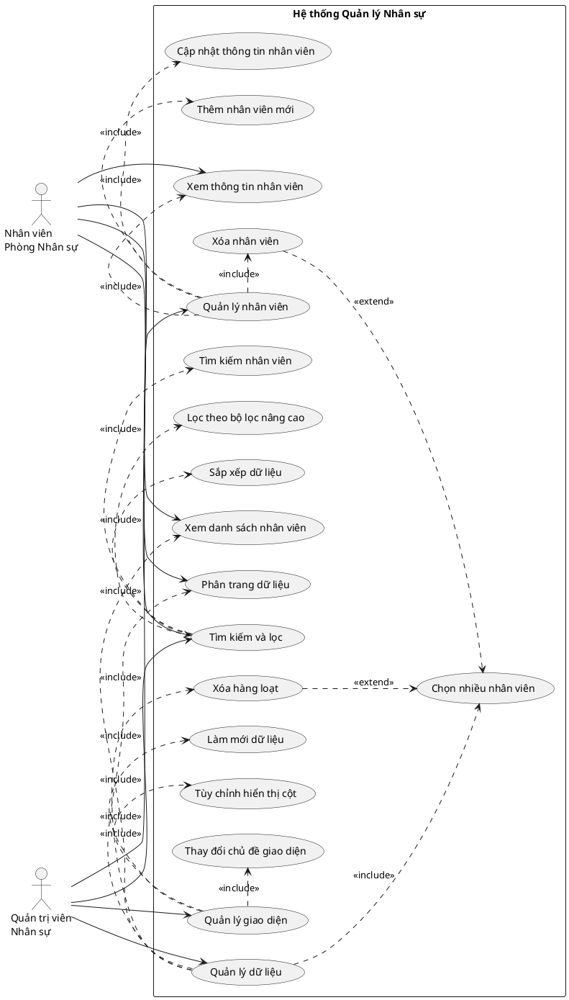
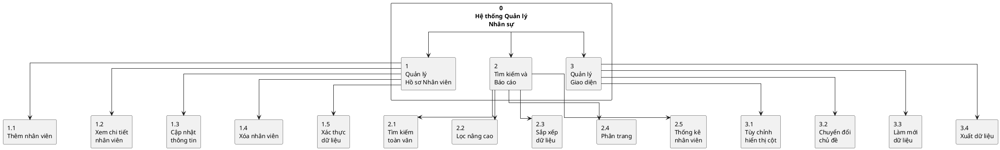
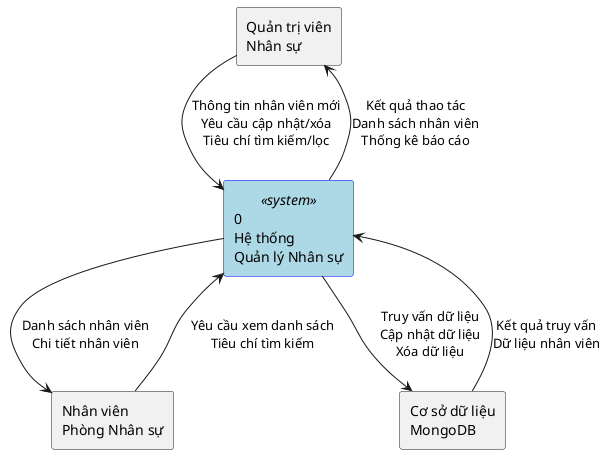
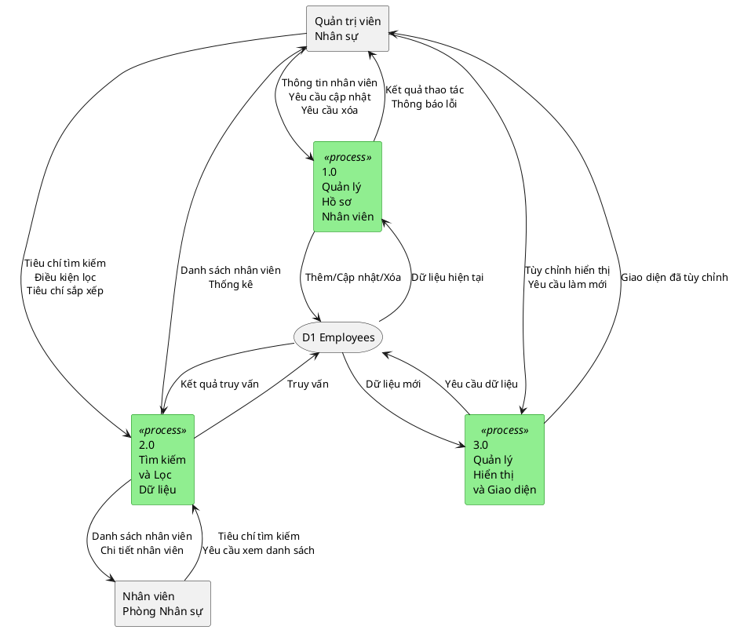
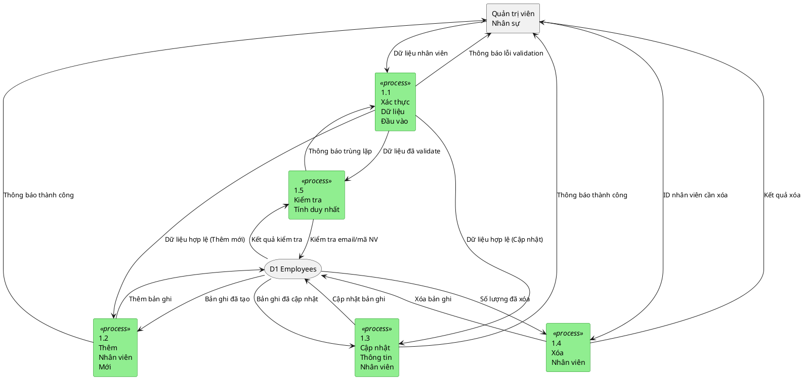
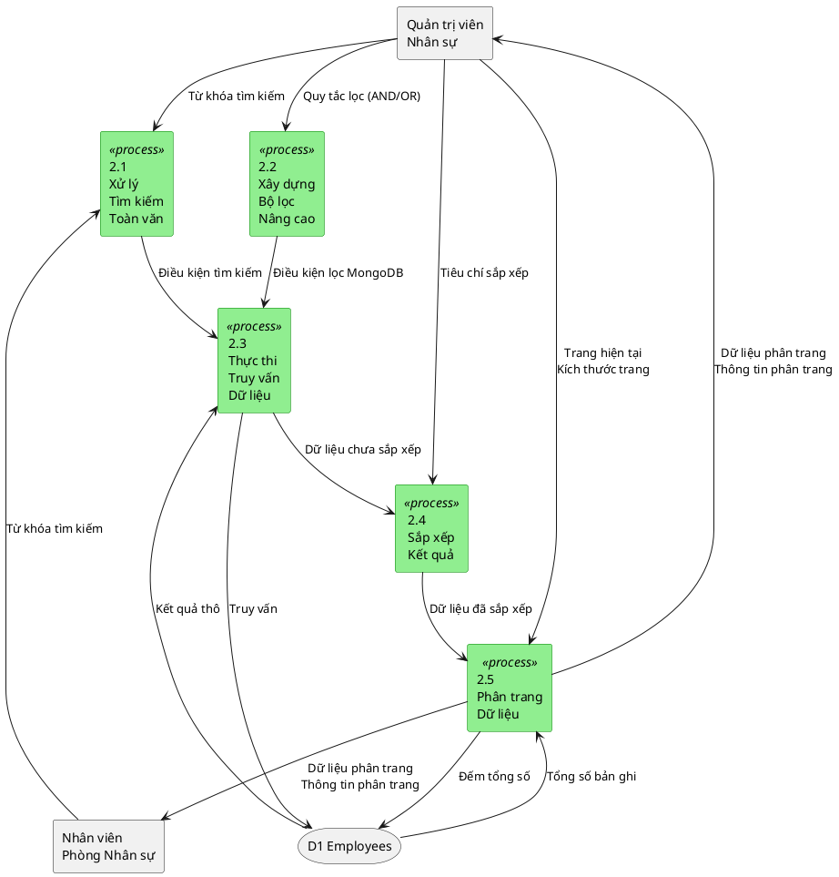
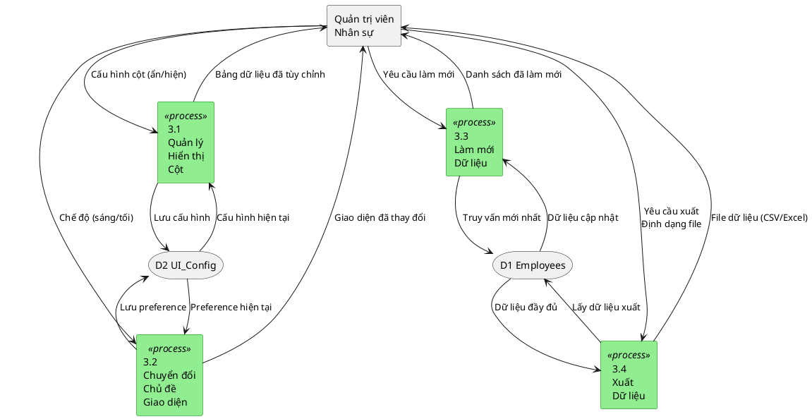
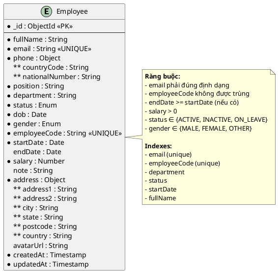

# BÁO CÁO HỆ THỐNG QUẢN LÝ NHÂN SỰ

## THÔNG TIN CHUNG

**Tên hệ thống:** Hệ thống Quản lý Nhân sự (Human Resource Management System)

**Ngày báo cáo:** 09/12/2025

**Người thực hiện:** PhucHuwu

---

## TÓM TẮT

Báo cáo này trình bày phân tích và thiết kế hệ thống quản lý nhân sự, một ứng dụng web hiện đại được xây dựng nhằm số hóa và tối ưu hóa quy trình quản lý thông tin nhân viên trong tổ chức. Hệ thống cung cấp các chức năng toàn diện bao gồm quản lý hồ sơ nhân viên, tìm kiếm và lọc dữ liệu nâng cao, cùng với giao diện người dùng trực quan và dễ sử dụng.

Báo cáo sử dụng các phương pháp phân tích và thiết kế hệ thống thông tin, bao gồm biểu đồ Use Case, biểu đồ phân cấp chức năng, biểu đồ luồng dữ liệu (DFD) từ mức ngữ cảnh đến mức chi tiết, và mô hình thực thể liên kết (ERD). Các biểu đồ được trình bày bằng ngôn ngữ PlantUML để đảm bảo tính chuẩn hóa và dễ bảo trì.

---

## 1. GIỚI THIỆU

### 1.1. Bối cảnh nghiên cứu

Trong bối cảnh chuyển đổi số, việc quản lý nhân sự hiệu quả là yếu tố then chốt quyết định sự thành công của tổ chức. Các phương pháp quản lý truyền thống dựa trên giấy tờ và bảng tính Excel đã bộc lộ nhiều hạn chế như: khó khăn trong việc tra cứu thông tin, thiếu tính nhất quán dữ liệu, rủi ro mất mát thông tin, và không đáp ứng được nhu cầu truy cập đồng thời của nhiều người dùng.

### 1.2. Mục tiêu nghiên cứu

Hệ thống được thiết kế với các mục tiêu cụ thể:

-   Số hóa hoàn toàn quy trình quản lý hồ sơ nhân viên
-   Cung cấp khả năng tìm kiếm và lọc thông tin nhanh chóng, chính xác
-   Đảm bảo tính toàn vẹn và bảo mật dữ liệu
-   Tạo giao diện thân thiện, dễ sử dụng cho người dùng cuối
-   Hỗ trợ mở rộng và tích hợp với các hệ thống khác trong tương lai

### 1.3. Phạm vi nghiên cứu

Báo cáo tập trung vào phân tích và thiết kế các chức năng cốt lõi của hệ thống quản lý nhân sự, bao gồm:

-   Quản lý thông tin nhân viên (thêm, xem, sửa, xóa)
-   Tìm kiếm và lọc dữ liệu theo nhiều tiêu chí
-   Sắp xếp và phân trang dữ liệu
-   Xuất nhập dữ liệu

---

## 2. PHÂN TÍCH HỆ THỐNG

### 2.1. Phân tích người dùng và ca sử dụng

Hệ thống được thiết kế chủ yếu phục vụ hai nhóm người dùng chính: Quản trị viên nhân sự (HR Manager) và Nhân viên phòng nhân sự (HR Staff). Biểu đồ Use Case dưới đây mô tả các tương tác chính của người dùng với hệ thống.

#### 2.1.1. Biểu đồ Use Case



#### 2.1.2. Mô tả các ca sử dụng chính

**Ca sử dụng 1: Quản lý nhân viên**

-   **Mục đích:** Cho phép người dùng thực hiện các thao tác CRUD (Create, Read, Update, Delete) trên dữ liệu nhân viên
-   **Tác nhân:** Quản trị viên nhân sự
-   **Tiền điều kiện:** Người dùng đã đăng nhập vào hệ thống
-   **Hậu điều kiện:** Dữ liệu nhân viên được cập nhật trong cơ sở dữ liệu

**Ca sử dụng 2: Tìm kiếm và lọc**

-   **Mục đích:** Hỗ trợ người dùng tìm kiếm và lọc thông tin nhân viên theo nhiều tiêu chí
-   **Tác nhân:** Quản trị viên nhân sự, Nhân viên phòng nhân sự
-   **Tiền điều kiện:** Có dữ liệu nhân viên trong hệ thống
-   **Hậu điều kiện:** Danh sách nhân viên được hiển thị theo tiêu chí tìm kiếm/lọc

**Ca sử dụng 3: Quản lý dữ liệu**

-   **Mục đích:** Quản lý cách hiển thị và thao tác với danh sách nhân viên
-   **Tác nhân:** Quản trị viên nhân sự, Nhân viên phòng nhân sự
-   **Tiền điều kiện:** Người dùng đang xem danh sách nhân viên
-   **Hậu điều kiện:** Dữ liệu được hiển thị theo cấu hình mong muốn

### 2.2. Phân cấp chức năng hệ thống

Biểu đồ phân cấp chức năng thể hiện cấu trúc tổng thể của hệ thống, chia thành các nhóm chức năng chính và các chức năng con.

#### 2.2.1. Biểu đồ phân cấp chức năng



#### 2.2.2. Mô tả các nhóm chức năng

**Nhóm 1: Quản lý Hồ sơ Nhân viên**

Nhóm chức năng này đảm nhiệm việc quản lý toàn bộ vòng đời của dữ liệu nhân viên trong hệ thống.

-   **1.1 Thêm nhân viên:** Cho phép nhập thông tin nhân viên mới vào hệ thống, bao gồm thông tin cá nhân, thông tin công việc, và thông tin liên hệ
-   **1.2 Xem chi tiết nhân viên:** Hiển thị đầy đủ thông tin của một nhân viên cụ thể
-   **1.3 Cập nhật thông tin:** Chỉnh sửa các thông tin đã có của nhân viên
-   **1.4 Xóa nhân viên:** Xóa hồ sơ nhân viên khỏi hệ thống (đơn lẻ hoặc hàng loạt)
-   **1.5 Xác thực dữ liệu:** Kiểm tra tính hợp lệ của dữ liệu đầu vào trước khi lưu

**Nhóm 2: Tìm kiếm và Báo cáo**

Nhóm chức năng hỗ trợ việc truy xuất và phân tích dữ liệu nhân viên.

-   **2.1 Tìm kiếm toàn văn:** Tìm kiếm nhân viên theo từ khóa trong các trường: họ tên, email, mã nhân viên, chức vụ, phòng ban
-   **2.2 Lọc nâng cao:** Lọc dữ liệu theo nhiều điều kiện với các toán tử logic AND/OR
-   **2.3 Sắp xếp dữ liệu:** Sắp xếp danh sách theo một hoặc nhiều trường
-   **2.4 Phân trang:** Chia nhỏ dữ liệu thành các trang để tối ưu hiệu suất
-   **2.5 Thống kê nhân viên:** Hiển thị các thông tin tổng hợp về nhân viên

**Nhóm 3: Quản lý Giao diện**

Nhóm chức năng liên quan đến tùy chỉnh giao diện người dùng.

-   **3.1 Tùy chỉnh hiển thị cột:** Cho phép ẩn/hiện các cột trong bảng dữ liệu
-   **3.2 Chuyển đổi chủ đề:** Chuyển đổi giữa chế độ sáng và tối
-   **3.3 Làm mới dữ liệu:** Tải lại dữ liệu từ server
-   **3.4 Xuất dữ liệu:** Xuất danh sách nhân viên ra các định dạng file

---

## 3. THIẾT KẾ LUỒNG DỮ LIỆU

### 3.1. Biểu đồ luồng dữ liệu mức ngữ cảnh

Biểu đồ mức ngữ cảnh (Context Diagram) cung cấp cái nhìn tổng quan nhất về hệ thống, thể hiện các thực thể bên ngoài và luồng dữ liệu tổng quát giữa chúng với hệ thống.



#### 3.1.1. Mô tả các luồng dữ liệu chính

**Luồng dữ liệu từ Quản trị viên nhân sự:**

-   **Đầu vào:** Thông tin nhân viên mới, yêu cầu cập nhật/xóa, tiêu chí tìm kiếm và lọc
-   **Đầu ra:** Kết quả thao tác, danh sách nhân viên, thống kê và báo cáo

**Luồng dữ liệu từ Nhân viên phòng nhân sự:**

-   **Đầu vào:** Yêu cầu xem danh sách, tiêu chí tìm kiếm
-   **Đầu ra:** Danh sách nhân viên, chi tiết nhân viên

**Luồng dữ liệu với Cơ sở dữ liệu:**

-   **Đầu vào (từ hệ thống):** Truy vấn dữ liệu, cập nhật dữ liệu, xóa dữ liệu
-   **Đầu ra (về hệ thống):** Kết quả truy vấn, dữ liệu nhân viên

### 3.2. Biểu đồ luồng dữ liệu mức đỉnh

Biểu đồ mức đỉnh (Level 0 DFD) phân rã hệ thống thành các tiến trình chính, thể hiện chi tiết hơn về cách dữ liệu được xử lý.



#### 3.2.1. Mô tả các tiến trình chính

**Tiến trình 1.0: Quản lý Hồ sơ Nhân viên**

-   **Đầu vào:** Thông tin nhân viên mới, yêu cầu cập nhật, yêu cầu xóa
-   **Xử lý:** Xác thực dữ liệu, thực hiện thao tác CRUD
-   **Đầu ra:** Kết quả thao tác, thông báo lỗi (nếu có)
-   **Tương tác dữ liệu:** Đọc/ghi vào D1 Employees

**Tiến trình 2.0: Tìm kiếm và Lọc Dữ liệu**

-   **Đầu vào:** Tiêu chí tìm kiếm, điều kiện lọc, tiêu chí sắp xếp
-   **Xử lý:** Xây dựng truy vấn, thực thi tìm kiếm/lọc, sắp xếp kết quả
-   **Đầu ra:** Danh sách nhân viên, thống kê
-   **Tương tác dữ liệu:** Đọc từ D1 Employees

**Tiến trình 3.0: Quản lý Hiển thị và Giao diện**

-   **Đầu vào:** Tùy chỉnh hiển thị, yêu cầu làm mới
-   **Xử lý:** Cập nhật cấu hình giao diện, tải lại dữ liệu
-   **Đầu ra:** Giao diện đã tùy chỉnh
-   **Tương tác dữ liệu:** Đọc từ D1 Employees

### 3.3. Biểu đồ luồng dữ liệu mức dưới đỉnh

#### 3.3.1. Sơ đồ mức dưới đỉnh 1: Quản lý Hồ sơ Nhân viên

Biểu đồ này phân rã chi tiết tiến trình 1.0 thành các tiến trình con.



**Mô tả các tiến trình con:**

-   **1.1 Xác thực Dữ liệu Đầu vào:** Kiểm tra tính hợp lệ của dữ liệu theo schema định nghĩa (email hợp lệ, số điện thoại đúng định dạng, ngày tháng logic, lương > 0, v.v.)

-   **1.2 Thêm Nhân viên Mới:** Tạo bản ghi nhân viên mới trong cơ sở dữ liệu sau khi đã xác thực và kiểm tra tính duy nhất

-   **1.3 Cập nhật Thông tin Nhân viên:** Chỉnh sửa thông tin nhân viên hiện có, đảm bảo không vi phạm ràng buộc duy nhất

-   **1.4 Xóa Nhân viên:** Xóa một hoặc nhiều bản ghi nhân viên khỏi hệ thống

-   **1.5 Kiểm tra Tính duy nhất:** Đảm bảo email và mã nhân viên không bị trùng lặp trong hệ thống

#### 3.3.2. Sơ đồ mức dưới đỉnh 2: Tìm kiếm và Lọc Dữ liệu

Biểu đồ này chi tiết hóa tiến trình 2.0 về xử lý tìm kiếm và lọc.



**Mô tả các tiến trình con:**

-   **2.1 Xử lý Tìm kiếm Toàn văn:** Chuyển đổi từ khóa tìm kiếm thành điều kiện regex MongoDB, tìm kiếm trong các trường: fullName, email, employeeCode, position, department

-   **2.2 Xây dựng Bộ lọc Nâng cao:** Phân tích các quy tắc lọc với logic AND/OR và chuyển đổi thành query MongoDB (hỗ trợ các toán tử: equals, contains, gt, gte, lt, lte, between, before, after, v.v.)

-   **2.3 Thực thi Truy vấn Dữ liệu:** Kết hợp điều kiện tìm kiếm và lọc, thực thi truy vấn vào cơ sở dữ liệu

-   **2.4 Sắp xếp Kết quả:** Sắp xếp dữ liệu theo một hoặc nhiều trường với thứ tự tăng/giảm dần

-   **2.5 Phân trang Dữ liệu:** Tính toán offset, limit, tổng số trang và trích xuất dữ liệu tương ứng với trang hiện tại

#### 3.3.3. Sơ đồ mức dưới đỉnh 3: Quản lý Hiển thị và Giao diện

Biểu đồ này mô tả chi tiết tiến trình 3.0 về quản lý giao diện.



**Mô tả các tiến trình con:**

-   **3.1 Quản lý Hiển thị Cột:** Cho phép người dùng chọn các cột muốn hiển thị/ẩn trong bảng dữ liệu, lưu cấu hình vào localStorage

-   **3.2 Chuyển đổi Chủ đề Giao diện:** Chuyển đổi giữa chế độ sáng (light mode) và tối (dark mode), lưu preference của người dùng

-   **3.3 Làm mới Dữ liệu:** Tải lại dữ liệu từ server để đảm bảo hiển thị thông tin mới nhất

-   **3.4 Xuất Dữ liệu:** Chuyển đổi dữ liệu nhân viên sang định dạng file (CSV, Excel) để người dùng tải xuống

---

## 4. THIẾT KẾ CƠ SỞ DỮ LIỆU

### 4.1. Mô hình thực thể liên kết (ERD)

Mô hình ERD mô tả cấu trúc cơ sở dữ liệu của hệ thống, bao gồm các thực thể, thuộc tính và mối quan hệ giữa chúng.



### 4.2. Mô tả chi tiết thực thể Employee

**Tên thực thể:** Employee (Nhân viên)

**Mục đích:** Lưu trữ toàn bộ thông tin về nhân viên trong tổ chức

**Thuộc tính:**

| Tên thuộc tính       | Kiểu dữ liệu | Ràng buộc        | Mô tả                                           |
| -------------------- | ------------ | ---------------- | ----------------------------------------------- |
| \_id                 | ObjectId     | PK, NOT NULL     | Khóa chính, tự động sinh bởi MongoDB            |
| fullName             | String       | NOT NULL         | Họ và tên đầy đủ của nhân viên                  |
| email                | String       | NOT NULL, UNIQUE | Email công ty, phải đúng định dạng              |
| phone.countryCode    | String       | NOT NULL         | Mã quốc gia điện thoại (vd: +84)                |
| phone.nationalNumber | String       | NOT NULL         | Số điện thoại (không bao gồm mã quốc gia)       |
| position             | String       | NOT NULL         | Chức vụ/vị trí công việc                        |
| department           | String       | NOT NULL, INDEX  | Phòng ban                                       |
| status               | Enum         | NOT NULL, INDEX  | Trạng thái làm việc: ACTIVE, INACTIVE, ON_LEAVE |
| dob                  | Date         | NOT NULL         | Ngày sinh                                       |
| gender               | Enum         | NOT NULL         | Giới tính: MALE, FEMALE, OTHER                  |
| employeeCode         | String       | NOT NULL, UNIQUE | Mã nhân viên duy nhất                           |
| startDate            | Date         | NOT NULL, INDEX  | Ngày bắt đầu làm việc                           |
| endDate              | Date         | NULL             | Ngày kết thúc hợp đồng (nếu có)                 |
| salary               | Number       | NOT NULL, >0     | Mức lương                                       |
| note                 | String       | NULL             | Ghi chú bổ sung                                 |
| address.address1     | String       | NOT NULL         | Địa chỉ dòng 1                                  |
| address.address2     | String       | NULL             | Địa chỉ dòng 2 (tùy chọn)                       |
| address.city         | String       | NOT NULL         | Thành phố                                       |
| address.state        | String       | NOT NULL         | Tỉnh/thành                                      |
| address.postcode     | String       | NOT NULL         | Mã bưu điện                                     |
| address.country      | String       | NOT NULL         | Quốc gia                                        |
| avatarUrl            | String       | NULL             | URL ảnh đại diện                                |
| createdAt            | Timestamp    | NOT NULL         | Thời điểm tạo bản ghi                           |
| updatedAt            | Timestamp    | NOT NULL         | Thời điểm cập nhật gần nhất                     |

**Các ràng buộc toàn vẹn:**

1. **Ràng buộc khóa chính:** \_id là khóa chính, duy nhất cho mỗi nhân viên
2. **Ràng buộc duy nhất:** email và employeeCode phải duy nhất trong toàn bộ hệ thống
3. **Ràng buộc miền giá trị:**
    - status ∈ {ACTIVE, INACTIVE, ON_LEAVE}
    - gender ∈ {MALE, FEMALE, OTHER}
    - salary > 0
4. **Ràng buộc logic:** endDate phải lớn hơn hoặc bằng startDate (nếu endDate không null)
5. **Ràng buộc định dạng:** email phải đúng chuẩn RFC 5322

**Indexes được tạo:**

-   Index duy nhất trên email (để kiểm tra nhanh và đảm bảo tính duy nhất)
-   Index duy nhất trên employeeCode
-   Index thường trên department (hỗ trợ lọc theo phòng ban)
-   Index thường trên status (hỗ trợ lọc theo trạng thái)
-   Index thường trên startDate (hỗ trợ sắp xếp và lọc theo ngày)
-   Index thường trên fullName (hỗ trợ tìm kiếm)

### 4.3. Chiến lược thiết kế cơ sở dữ liệu

**4.3.1. Lựa chọn MongoDB**

Hệ thống sử dụng MongoDB - một cơ sở dữ liệu NoSQL hướng document vì các lý do sau:

-   **Linh hoạt schema:** Dễ dàng mở rộng thêm trường mới khi yêu cầu thay đổi
-   **Hiệu suất cao:** Truy vấn nhanh với các index được tối ưu
-   **Embedded documents:** Cho phép lưu trữ phone và address như nested objects, phản ánh đúng cấu trúc dữ liệu
-   **Khả năng mở rộng:** Dễ dàng scale horizontal khi dữ liệu tăng lên

**4.3.2. Normalization vs Denormalization**

Hệ thống hiện tại sử dụng một collection duy nhất (Employee) với embedded documents cho phone và address. Điều này phù hợp vì:

-   Thông tin phone và address luôn được truy xuất cùng với nhân viên
-   Không có yêu cầu tái sử dụng address cho nhiều nhân viên
-   Giảm số lượng JOIN operations, tăng hiệu suất đọc

Trong tương lai, nếu hệ thống mở rộng, có thể tách Department và Position thành các collections riêng để đảm bảo tính nhất quán.

**4.3.3. Chiến lược Index**

Các index được thiết kế dựa trên phân tích các truy vấn phổ biến:

-   **Unique indexes** (email, employeeCode): Đảm bảo tính duy nhất và tăng tốc độ kiểm tra
-   **Regular indexes** (department, status, startDate, fullName): Hỗ trợ filtering và sorting
-   **Compound indexes** (có thể thêm trong tương lai): Ví dụ {department: 1, status: 1} cho truy vấn kết hợp

---

## 5. ĐÁNH GIÁ VÀ KẾT LUẬN

### 5.1. Đánh giá thiết kế

**5.1.1. Ưu điểm**

1. **Kiến trúc rõ ràng:** Hệ thống được thiết kế theo mô hình phân lớp với sự phân tách rõ ràng giữa presentation, business logic, và data access

2. **Khả năng mở rộng:** Thiết kế modular cho phép dễ dàng thêm các chức năng mới như quản lý phòng ban, quản lý chấm công, tính lương, v.v.

3. **Hiệu suất tối ưu:** Sử dụng pagination, indexing, và caching giúp hệ thống xử lý tốt với lượng dữ liệu lớn

4. **Trải nghiệm người dùng:** Giao diện responsive, hỗ trợ dark mode, và các thao tác trực quan

5. **Bảo mật dữ liệu:** Validation chặt chẽ ở cả client và server, đảm bảo tính toàn vẹn dữ liệu

**5.1.2. Hạn chế và hướng cải thiện**

1. **Xác thực và phân quyền:** Hiện tại chưa có hệ thống authentication/authorization. Cần bổ sung JWT-based auth với role-based access control (RBAC)

2. **Audit trail:** Chưa có cơ chế ghi log các thay đổi dữ liệu. Nên thêm collection EmployeeHistory để track changes

3. **Backup và recovery:** Cần thiết lập chiến lược backup tự động cho MongoDB

4. **API versioning:** API hiện tại chưa có versioning, cần thêm để đảm bảo backward compatibility

5. **Testing:** Cần bổ sung unit tests, integration tests, và e2e tests

### 5.2. Tính mới và đóng góp

Hệ thống đã áp dụng các công nghệ và phương pháp hiện đại:

-   **Server-side rendering với Next.js App Router:** Cải thiện SEO và initial load time
-   **Type-safe validation với Zod:** Đảm bảo type safety từ runtime đến compile time
-   **Advanced filtering:** Hệ thống lọc linh hoạt với logic AND/OR, hỗ trợ nhiều toán tử
-   **Optimistic UI updates:** Cải thiện trải nghiệm người dùng với phản hồi tức thì

### 5.3. Khả năng ứng dụng thực tế

Hệ thống quản lý nhân sự này có thể được triển khai cho:

-   **Doanh nghiệp vừa và nhỏ (SME):** Từ 50-500 nhân viên
-   **Startup:** Cần giải pháp quản lý nhân sự nhanh chóng và hiệu quả về chi phí
-   **Phòng/ban nhân sự:** Trong các tổ chức lớn hơn như một module độc lập

### 5.4. Hướng phát triển tương lai

**Giai đoạn 1 (Ngắn hạn - 3-6 tháng):**

-   Triển khai hệ thống authentication & authorization
-   Bổ sung quản lý phòng ban và chức vụ
-   Thêm chức năng import/export dữ liệu hàng loạt
-   Xây dựng dashboard với charts và statistics

**Giai đoạn 2 (Trung hạn - 6-12 tháng):**

-   Tích hợp quản lý chấm công và nghỉ phép
-   Xây dựng module tính lương
-   Thêm hệ thống thông báo (notifications)
-   Phát triển mobile app (React Native)

**Giai đoạn 3 (Dài hạn - 12+ tháng):**

-   Tích hợp AI/ML cho dự đoán nghỉ việc (attrition prediction)
-   Hệ thống đánh giá hiệu suất (performance review)
-   Tích hợp với các hệ thống bên ngoài (HRIS, payroll providers)
-   Xây dựng self-service portal cho nhân viên

### 5.5. Kết luận

Hệ thống quản lý nhân sự đã được thiết kế và xây dựng dựa trên các nguyên tắc kỹ thuật phần mềm hiện đại, đảm bảo tính khoa học, hợp lý và khả thi. Các biểu đồ phân tích (Use Case, DFD, ERD) cung cấp cái nhìn toàn diện về cấu trúc và hoạt động của hệ thống.

Báo cáo đã trình bày đầy đủ 5 loại biểu đồ theo yêu cầu:

1. **Biểu đồ Use Case:** Mô tả các tương tác giữa người dùng và hệ thống
2. **Biểu đồ phân cấp chức năng:** Thể hiện cấu trúc phân cấp các chức năng
3. **Biểu đồ luồng dữ liệu mức ngữ cảnh:** Cái nhìn tổng quan về hệ thống
4. **Biểu đồ luồng dữ liệu mức đỉnh:** Phân rã thành các tiến trình chính
5. **Biểu đồ luồng dữ liệu mức dưới đỉnh:** Chi tiết 3 nhóm chức năng chính
6. **Mô hình ERD:** Cấu trúc cơ sở dữ liệu chi tiết

Hệ thống đã sẵn sàng cho việc triển khai và có khả năng mở rộng tốt để đáp ứng các yêu cầu kinh doanh trong tương lai. Với kiến trúc linh hoạt và công nghệ hiện đại, hệ thống có thể phát triển thành một giải pháp quản lý nhân sự toàn diện cho các tổ chức ở nhiều quy mô khác nhau.

---

## TÀI LIỆU THAM KHẢO

1. **Pressman, R. S., & Maxim, B. R.** (2020). _Software Engineering: A Practitioner's Approach_ (9th ed.). McGraw-Hill Education.

2. **Sommerville, I.** (2016). _Software Engineering_ (10th ed.). Pearson.

3. **Elmasri, R., & Navathe, S. B.** (2015). _Fundamentals of Database Systems_ (7th ed.). Pearson.

4. **Fowler, M.** (2003). _Patterns of Enterprise Application Architecture_. Addison-Wesley.

5. **MongoDB Documentation** (2025). _MongoDB Manual_. Retrieved from https://docs.mongodb.com/

6. **Next.js Documentation** (2025). _Next.js App Router_. Retrieved from https://nextjs.org/docs

7. **React Documentation** (2025). _React 19 Documentation_. Retrieved from https://react.dev/

8. **Zod Documentation** (2025). _TypeScript-first schema validation_. Retrieved from https://zod.dev/

9. **TanStack Table Documentation** (2025). _Headless UI for building powerful tables_. Retrieved from https://tanstack.com/table/

10. **PlantUML Documentation** (2025). _Open-source tool for creating UML diagrams_. Retrieved from https://plantuml.com/

---

## PHỤ LỤC

### Phụ lục A: Bảng thuật ngữ

| Thuật ngữ                         | Viết tắt | Định nghĩa                               |
| --------------------------------- | -------- | ---------------------------------------- |
| Human Resource Management         | HRM      | Quản lý nguồn nhân lực                   |
| Create, Read, Update, Delete      | CRUD     | Các thao tác cơ bản trên dữ liệu         |
| Data Flow Diagram                 | DFD      | Biểu đồ luồng dữ liệu                    |
| Entity Relationship Diagram       | ERD      | Biểu đồ thực thể liên kết                |
| Application Programming Interface | API      | Giao diện lập trình ứng dụng             |
| JavaScript Object Notation        | JSON     | Định dạng dữ liệu dạng văn bản           |
| NoSQL                             | -        | Not Only SQL - Cơ sở dữ liệu phi quan hệ |
| Object Document Mapper            | ODM      | Ánh xạ đối tượng-tài liệu                |

### Phụ lục B: Cấu trúc thư mục dự án

```
Humman-resource-main/
├── app/                    # Next.js App Router
│   ├── api/               # API Routes
│   │   └── employees/     # Employee endpoints
│   ├── globals.css        # Global styles
│   ├── layout.tsx         # Root layout
│   └── page.tsx           # Home page
├── components/            # React components
│   ├── employees/         # Employee-specific components
│   └── ui/               # Reusable UI components
├── lib/                   # Utility libraries
│   ├── models/           # Mongoose models
│   ├── validators/       # Zod schemas
│   ├── db.ts             # Database connection
│   └── utils.ts          # Helper functions
├── public/               # Static assets
├── scripts/              # Setup and seed scripts
└── types/                # TypeScript definitions
```

### Phụ lục C: Bảng tổng hợp chức năng

| ID   | Chức năng          | Mô tả ngắn                | Người dùng   | Độ ưu tiên |
| ---- | ------------------ | ------------------------- | ------------ | ---------- |
| F1.1 | Thêm nhân viên     | Tạo hồ sơ nhân viên mới   | Admin        | Cao        |
| F1.2 | Xem chi tiết       | Hiển thị thông tin đầy đủ | Admin, Staff | Cao        |
| F1.3 | Cập nhật thông tin | Chỉnh sửa hồ sơ           | Admin        | Cao        |
| F1.4 | Xóa nhân viên      | Xóa hồ sơ khỏi hệ thống   | Admin        | Trung bình |
| F1.5 | Xác thực dữ liệu   | Kiểm tra tính hợp lệ      | Hệ thống     | Cao        |
| F2.1 | Tìm kiếm toàn văn  | Tìm theo từ khóa          | Admin, Staff | Cao        |
| F2.2 | Lọc nâng cao       | Lọc theo nhiều điều kiện  | Admin        | Cao        |
| F2.3 | Sắp xếp dữ liệu    | Sắp xếp theo tiêu chí     | Admin, Staff | Trung bình |
| F2.4 | Phân trang         | Chia nhỏ danh sách        | Hệ thống     | Cao        |
| F2.5 | Thống kê           | Hiển thị số liệu tổng hợp | Admin        | Thấp       |
| F3.1 | Tùy chỉnh hiển thị | Ẩn/hiện cột               | Admin        | Thấp       |
| F3.2 | Chuyển đổi chủ đề  | Dark/Light mode           | Admin        | Thấp       |
| F3.3 | Làm mới dữ liệu    | Reload từ server          | Admin, Staff | Trung bình |
| F3.4 | Xuất dữ liệu       | Export CSV/Excel          | Admin        | Trung bình |

---

**KẾT THÚC BÁO CÁO**
